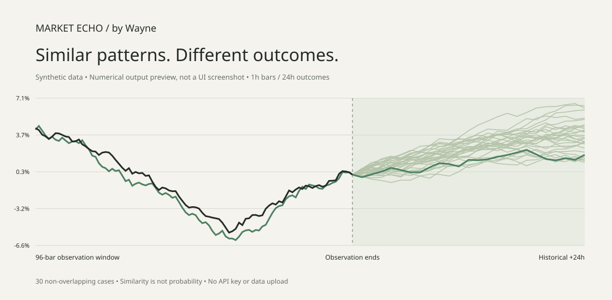

# Market Echo

**Historical patterns, understandable endpoints, optional AI explanations.**

Find similar historical price windows, inspect how they ended, and see what the same percentage moves would mean at your observation price. Extracted from Wayne's Fieldnote. This is historical research, **not a price forecast or trading signal**.

[中文](README.zh-CN.md) · [Methodology](docs/METHODOLOGY.md) · [AI setup](docs/AI.md) · [Verification](docs/VERIFICATION.md)



*Synthetic numerical preview; not real-market performance.*

[Three-minute walkthrough & FAQ](docs/QUICKSTART.md) · [Report an issue](https://github.com/pruettlazaro143-a11y/market-echo/issues/new/choose)

## Start

```sh
git clone https://github.com/pruettlazaro143-a11y/market-echo.git
cd market-echo
```

Node.js 22+ is required. In the project directory, run:

```sh
npm start
```

Open **http://127.0.0.1:4173**. No `npm install`, database or account needed. The language selector switches the interface, help text and AI output language between Chinese and English. Initial data is **synthetic**.

```sh
npm test
npm run example
npm run build
```

`dist/` supports static hosting and retrieval without AI. AI forwarding requires the local Node server. Do not double-click the HTML file; modules and Workers require HTTP. The server is loopback-only; it is **not a multi-user AI proxy**.

## Understand the numbers

1. **Baseline:** the last closed price in the observation window, with a UTC timestamp. It is not a live quote.
2. **Horizon:** e.g. 24 hours after that cutoff. Equity dates remain unassigned without a verified calendar.
3. **Rebased historical endpoint:** baseline × (1 + historical case return).

If the baseline is 100 and a historical case changed +2%, its rebased endpoint is 102. This answers “what would an equivalent move amount to?”, not “where will the market go?”. Each chart shows an endpoint dot, price/change callout, baseline marker and horizon. Tables show historical original prices separately from rebased prices.

Median and P10–P90 are descriptive summaries, **not forecast targets or confidence intervals**. Actual future prices are unavailable and remain explicitly unfilled. No paper/live trades are placed.

## Markets

| Category | Detail | Scope |
|---|---|---|
| Crypto | BTC, ETH | Shape, structure, volatility and available volume |
| Crypto | Other assets | Shape/structure only; historical percentages, no rebased price targets |
| US equities | User-provided ticker | Imported series; observed-session counting |
| China A-shares | User-provided ticker | **Daily bars only** in v0.2; no holiday-calendar claim |
| Gold & metals | Gold, silver, other metals | User CSV; spot/reference/futures metadata |

Market selection does not download or validate a feed. All markets need your own consistent CSV. Specify the quote unit (e.g. USDT, USD, CNY, USD/oz). Instrument type is retained separately, not used to mix spot/futures histories. No news, earnings, macro, liquidity or token-mechanism analysis is included in numerical matching.

## CSV

Required: `timestamp,open,high,low,close`. Optional: `volume,end` (or short column names `t,o,h,l,c,v`). Plain comma-separated, no quoted fields. Maximum 5 MB / 20,000 bars.

- Timestamp = bar open; use Unix seconds/milliseconds or ISO with timezone, e.g. `2025-01-01T00:00:00Z`.
- Missing `end` is inferred from the selected interval. Daily session markets may supply an actual close timestamp with a shorter session duration.
- Supported intervals: 5m, 15m, 1h, 4h, 1d. A-shares currently require 1d.
- Latest 96 closed bars form the query. More prior history is required for completed outcomes; zero matches is valid.
- Duplicate timestamps, invalid OHLC, missing required fields and continuous-market gaps are checked. No automatic split/roll/holiday adjustment.
- `examples/synthetic-btc-1h.csv`: 5,200 generated bars, **crypto/BTC, spot, 1h**. Mark synthetic; filename prefix `synthetic-` also preselects this checkbox.

## Optional BYOK AI

Run retrieval, select DeepSeek / OpenAI / Anthropic, enter your provider's exact model ID and API key, inspect the evidence preview and consent before each new result/provider. **API fees are paid to your provider.** Other OpenAI-compatible endpoints can be configured by the local server operator; see [AI.md](docs/AI.md).

AI returns four prose sections: summary, similarities, differences and limitations. Numeric calculations stay in the deterministic engine. Numeric/transactional prose is rejected by a conservative output check; this check is not a complete semantic safety guarantee. No raw HTML is rendered.

CSV stays in browser memory for retrieval. AI sends a small, inspectable summary through the local server to exactly the chosen provider. The full CSV is not sent. Keys remain in transient page/server memory, are not written to this project's disk/logs/browser storage, and are cleared on provider changes or by the clear-key button. Provider data policies still apply. No automatic retry, credential fallback or provider switching.

## Status and contribution

Version **0.2.0**. Existing engine plus standalone bilingual UI, endpoint arithmetic, market taxonomy and local AI gateway. No private Fieldnote database, payment integration, production keys or old Git history is included. Built-in CSV is synthetic.

See [verification](docs/VERIFICATION.md) for exactly what was tested. Live provider calls, real-browser visuals and public deployment must not be inferred from passing unit tests. The provided CI runs tests/build; it does not publish.

[Contributing](CONTRIBUTING.md) · [MIT license](LICENSE) · [Release steps](docs/RELEASE.md) · [Launch copy](docs/LAUNCH.md)
